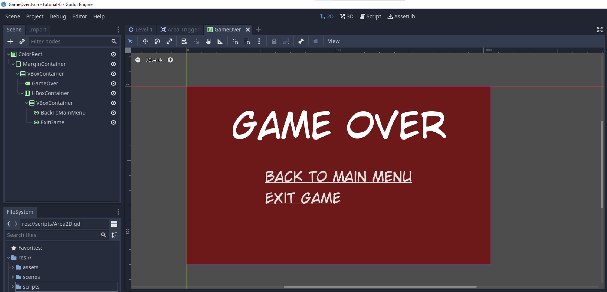
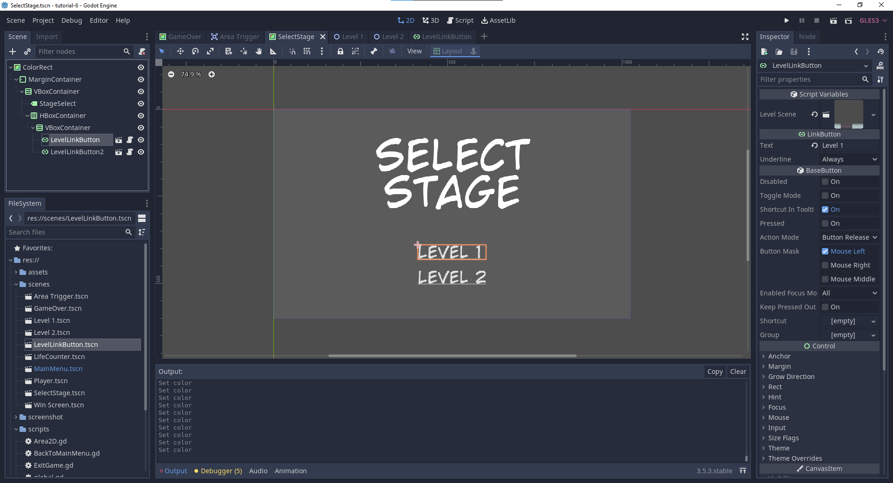
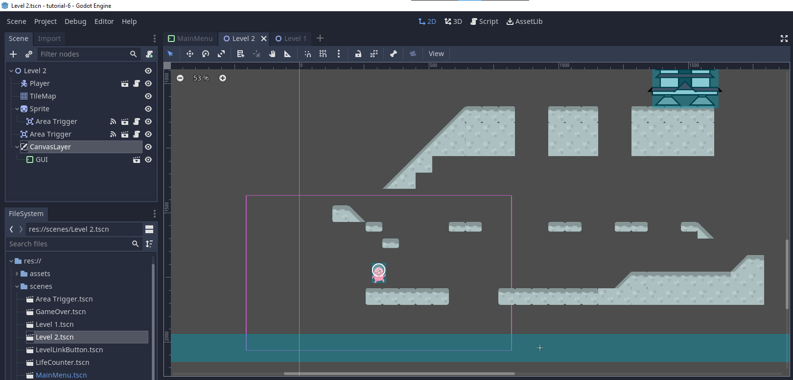
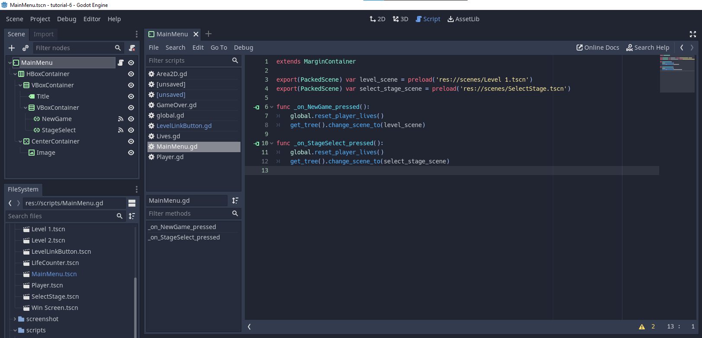
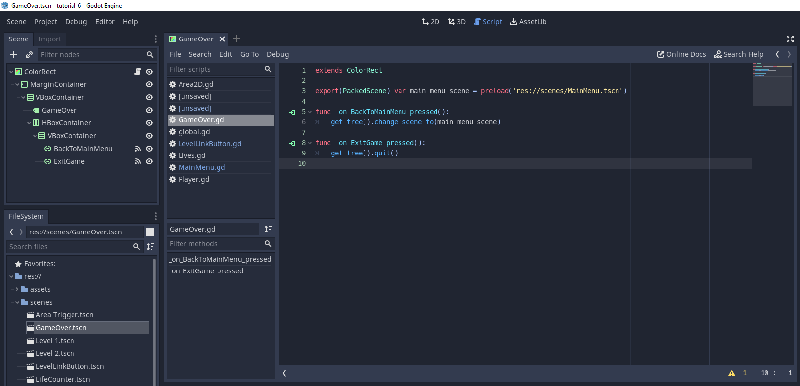
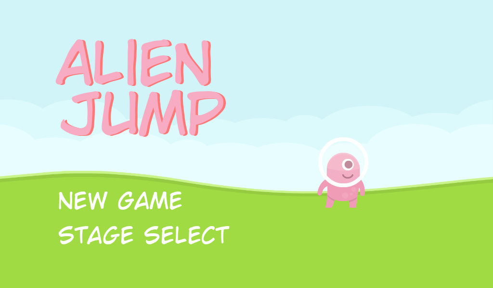
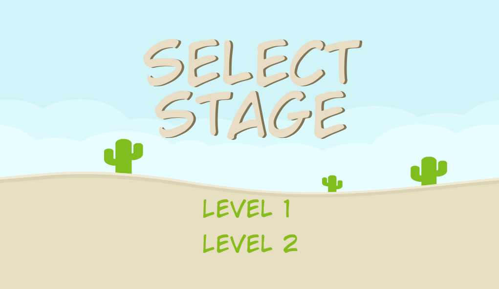
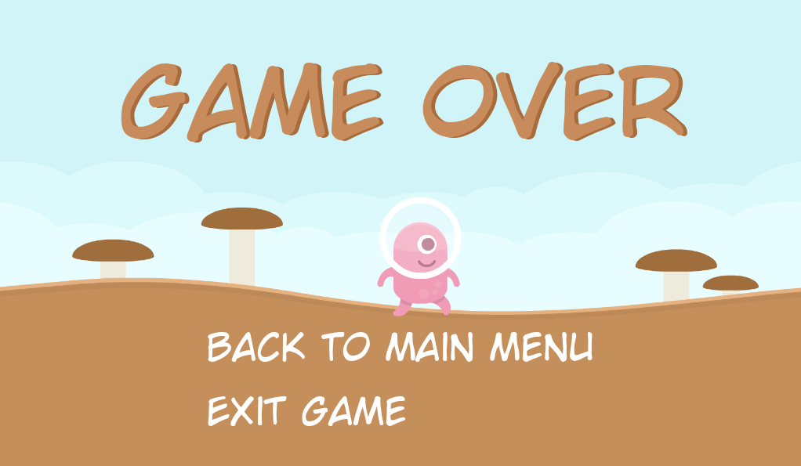

# Tutorial 6 - Game Development 2023/2024

> Godot Version: 3.5.3

## Tombol pada layar game over untuk kembali ke menu utama

Untuk menambahkan tombol pada layar *game over*, saya menyesuaikan struktur dan layout dari layar *game over* dengan menggunakan *container* yang sesuai, seperti `MarginContainer`, `VBoxContainer`, dan `HBoxContainer,` agar tombol dapat diletakkan di posisi yang diinginkan dan lebih rapih. Kemudian, saya menambahkan 2 tombol, yaitu tombol untuk kembali ke menu utama (node `BackToMainMenu`) dan tombol untuk keluar dari permainan (node `ExitGame`). Berikut adalah tampilan dari layar *game over*.



Setelah itu, saya menambahkan script ke `LinkButton` yang sesuai agar tombol `BackToMainMenu` mengarahkan pemain ke layar menu utama ketika ditekan dan tombol `ExitGame` mengeluarkan pemain dari permainan. Berikut adalah implementasi script untuk masing-masing `LinkButton`.

`BackToMainMenu.gd`

```py
extends LinkButton

export(PackedScene) var main_menu_scene = preload('res://scenes/MainMenu.tscn')

func _on_BackToMainMenu_pressed():
    get_tree().change_scene_to(main_menu_scene)
```

`ExitGame.gd`

```py
extends LinkButton

func _on_ExitGame_pressed():
    get_tree().quit()
```

## Fitur Select Stage

Hal ini dapat dilakukan dengan membuat menu `SelectStage.tscn` terlebih dahulu. Pada menu ini, pemain dapat memilih level yang ingin dimainkan. Tampilan menu `SelectStage.tscn` adalah sebagai berikut.



Pada menu ini, saya membuat scene baru, yaitu scene `LevelLinkButton` yang dapat mengarahkan pemain ke scene level tertentu sesuai dengan konfigurasi. Hal ini diperlukan untuk mendukung *reusability*. Berikut adalah implementasinya.

`LevelLinkButton.gd`

```py
extends LinkButton

export(PackedScene) var level_scene

func _on_LevelLinkButton_pressed():
    get_tree().change_scene_to(level_scene)
```

Kemudian, saya tinggal menghubungkan `LinkButton` Stage Select pada `MainMenu.tscn` ke scene di atas yang telah saya buat. Berikut adalah implementasi scriptnya.

```py
extends LinkButton

var select_stage_scene = preload('res://scenes/SelectStage.tscn')

func _on_StageSelect_pressed():
    get_tree().change_scene_to(select_stage_scene)
```

Hasil video dapat dilihat di [`./screenshot/select_stage.mp4`](./screenshot/select_stage.mp4)

https://github.com/LyzanderAndrylie/gamedev-tutorial-6/assets/107832263/db0e3b75-1172-4f6a-ae79-b3eebc8f0524

## Polishing

Pada tahap ini, saya memperbaiki dan menambahkan berbagai elemen agar tampilan menjadi lebih menarik. Detailnya adalah sebagai berikut.

1. Men-reset `global.lives` ketika pemain ingin mengulang permainan.

    Hal ini dilakukan untuk memastikan `lives` dari pemain tidak 0 atau negatif ketika pemain mengulang permainan. Implementasi pada tutorial belum meng-*hanlde* kasus ini. Hasilnya adalah sebagai berikut.

    `global.gd`

    ```py
    extends Node

    const DEFAULT_LIVE = 3
    var lives = DEFAULT_LIVE

    func reset_player_lives():
        lives = DEFAULT_LIVE
    ```

    fungsi `reset_player_lives()` akan dipanggil ketika pemain mengklik **New Game** atau **Stage Select** pada `MainMenu.tscn`.

2. Menambahkan GUI `Lives.tscn` pada Level 2.

    

3. Menggabungkan script dari child ke parent script.

    Hal ini diperlukan agar script tidak terlalu berantakan. Contohnya adalah script `NewGame.gd` dan `StageSelect.gd` dapat digabung menjadi `MainMenu.gd` dan script `BackToMainMenu.gd` dan `ExitGame.gd` dapat digabung menjadi `GameOver.gd`.

    

    

4. Meningkatkan layar menu, layar pemilihan level, dan layer game over.

    Ada beberapa peningkatan yang dilakukan pada layar tersebut.

    1. Menghilangkan underline dari setiap `LinkButton` yang ada.
    2. Menambahkan animasi karakter pada layar menu dan layar game over.
    3. Menambahkan background untuk masing-masing layar.
    4. Menyesuaikan warna font dengan background.

    Hasilnya adalah sebagai berikut.

    
    
    

    Hasil video dapat dilihat di [`./screenshot/menu.mp4`](./screenshot/menu.mp4)

    https://github.com/LyzanderAndrylie/gamedev-tutorial-6/assets/107832263/0bc95431-3689-4850-a924-2db71311f46a

## Sumber Referensi

1. [Scene Tree](https://media.giphy.com/media/vFKqnCdLPNOKc/giphy.gif)
